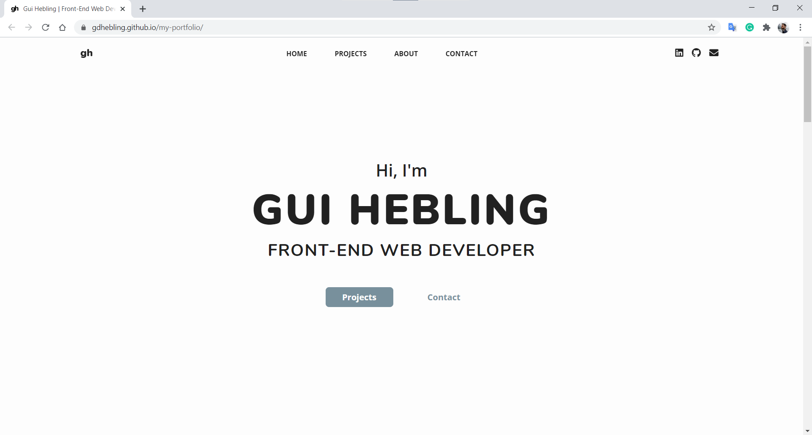

# My Portfolio

## The project

My Front-End Developer Portfolio.  
Clean and modern web design for my portfolio.
  

### Deployed website

You can find the deployed website at https://gdhebling.com/
  
The website is now ported to a Gatsby + Sanity project.  
This is the code repository for the original project using vanilla HTML, SCSS, JavaScript.  

The goal was to write reusable code and design concepts.  

## Technologies and tools used

HTML5, CSS3, SCSS/Sass, JavaScript.  

    &nbsp;&nbsp;
    &nbsp;&nbsp;
    &nbsp;&nbsp;
    &nbsp;&nbsp;

## That's it!

Thanks for reading! 😀  
I'm Guilherme. Front-End Web Developer.  

You can find me on:  

&nbsp;&nbsp;

[website]: [https://gdhebling.github.io/my-portfolio/]
